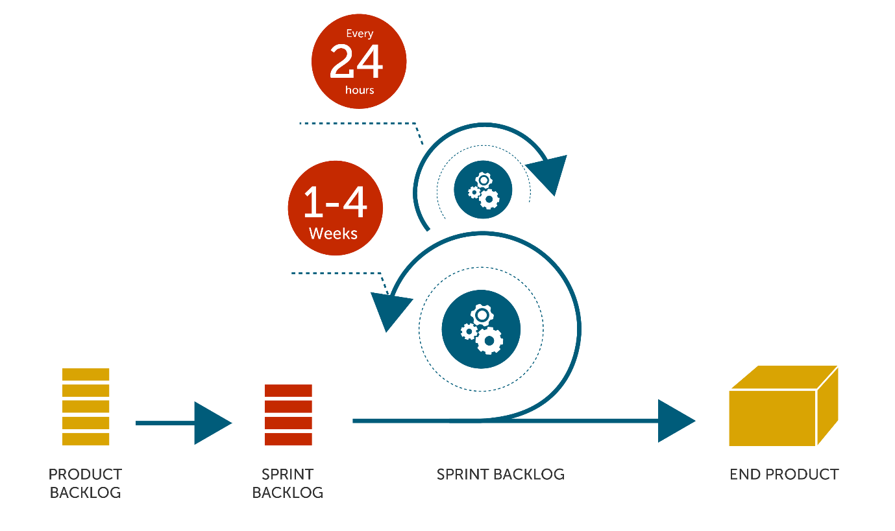

##Group 19: Comparison of Agile and Waterfall Project Management

###Introduction

Agile and Waterfall are two of the most common methodologies used in software development. They are fundamentally different - Agile was designed to make up for Waterfall's shortcomings (e.g. Agile can implement changes swiftly, while Waterfall does not). Nowadays, the popularity of Waterfall is reducing due to more people preferring Agile. In this essay, I will explain each of the methodologies, and show the differences between them.

The waterfall model is a sequential design process, used in software development processes[7]. This method is very easy to use and understand. Each step in the progress is flowing steadily from the top to bottom like a waterfall.

###A visual guide to Waterfall[10]

In the Waterfall model, each step must be finished before the next step can begin, therefore the steps must not overlap. This model is best used for the for small projects and cannot include uncertain requirements, as Waterfall does not allow changing these requirements. At the end of each step, a review takes place to check if the project is relevant, and decide whether or not to carry on or cancel the project. The testing will only start when the development stage is completed[2].

An Agile software development methodology, such as Scrum, is an incremental and iterative sequential approach for managing product development. This method defines a flexible, holistic product development strategy where the cross-functional team works as a unit to reach common goal[8].

###A visual guide to Agile[5]

The steps of the scrum are shown below[9]:

1.  A product owner creates a prioritised list of the product's requirements called product backlog. The requirements are gathered from the end users, customers, team and other stakeholders.

2.  The sprint backlog contains all the requirements in the current sprint. During sprint planning, the team pulls a small piece from the top of that prioritised list and implements those pieces together.

3.  A sprint indicates the amount of time that the team have to finish its work. The length of a sprint is usually 2 to 4 weeks. 

4.  A scrum meeting takes place daily to assess the team's progress during the sprint.

5.  At the end of every sprint, the development team should be able to deliver a potentially shippable product that is tested and works well to the customer and stakeholders.
  
6.  The sprint ends with a sprint review and customers' feedback.
  
7.  The next sprint starts, the development team select another piece of the requirements from the prioritised list and begins working again.

###Main

In terms of structure, the two methodologies are complete opposites. Agile consists of incremental, iterative work cadences [1] called sprints (sections of time often 2-4 weeks in length whereby a set of tasks is decided, worked upon and reviewed). Waterfall (aka linear-sequential life cycle model[2]) is linear; there are multiple phases (requirements, design, implementation, verification, maintenance) which cannot overlap; the previous phase must be completed before the next can start. These phases often have phase gates in-between (e.g. requirements being reviewed and approved before design can begin).

Another difference is the level of stakeholder/customer involvement.  With Agile, stakeholders are consulted at least once during every sprint, either during planning or review (a sprint review is called a retrospective; reviewing tickets is called refinement). This hands on approach can them give a strong sense of ownership [3] and a thorough understanding of the product, but may not suit stakeholders who may not have the time or interest for this type of participation.[3] In Waterfall development the stakeholders are consulted at the beginning when discussing requirements, then shown the final product at the end (except for reviews, approvals, status meetings, etc., a customer presence is not strictly required after the requirements phase.[3]) which may cause issues if the final delivered software is not as expected.

The ease of amending the project mid-development varies with the method used. A Waterfall project may be doomed if the initial requirements (which it relies heavily on) are faulty in any manner. (If a requirement error is found, or a change needs to be made, the project has to start from the beginning with all new code.[4]). Once testing has started amendments are almost impossible to make without disrupting all other completed phases; there is no method to work backwards. If a bug is found the entire process must be restarted to create a fix. With Agile the project is reviewed at the end of each sprint; any bugs discovered are immediately placed into the sprint backlog to be dealt with, and customers are consulted to ensure the project remains on track. This allows for changes to be easily incorporated, and any issue to be ironed out. Agile methods are more flexible than the waterfall method which means that customers requests are more likely to be met[5]. However, Agile lacks definitive planning; the final deliverable may be fairly different from what was initially intended.

Team members in Agile and Waterfall differ in the number of roles they play; Agile teams are formed (mostly) of generalising specialist someone who has one or more technical specialties (e.g. Java programming, project management, database administration)[6]. In Agile, if someone is working on a particular task and has become stuck, they should be able to call on any member of the team to provide (at least some) basic assistance. This makes the team much more fluid as a whole, and the chance of completing tasks increases. Waterfall teams consist of people that perform only their dedicated role. However this does not mean they are sat idly when their phase is complete; it is possible for various members of the team to be involved or to continue with other work, depending on the active phase of the project.[3] In both methodologies team members can be lent from one team to another.

Deciding which methodology to use comes down to the type of project. Agile is modular development; well suited to object-oriented projects with various different features and requirements. However Agile may lose its way with large projects/organisations and introduce extra inefficiencies[5]. Waterfall works great with small projects with clearly defined requirements and a well thought out plan, where the likelihood of deviation is low.

Agile puts an emphasis on speed; throughout development there are many, small releases (a working piece of software could be delivered after a single sprint; because the products are tested so thoroughly with Agile, the product could be launched at the end of any cycle[4]). The lack of real documentation in Agile is not so much of an issue when the customer can step in at almost any point and put a hold to features they deem unworthy, or suggest new features. In contrast, Waterfall emphasises record keeping (the entire project is pre-planned and the plan followed during each phase; At the end of each phase, a review takes place to determine if the project is on the right path and whether or not to continue or discard the project[2]). This is needed as Waterfall has only one main release, at the end of the project lifecycle. If the planning was not performed thoroughly enough, the end product will almost certainly not meet requirements, and the customer will be unhappy.

###Bibliography

* [1]: http://agilemethodology.org/  
 
* [2]: http://istqbexamcertification.com/what-is-waterfall-model-advantages-disadvantages-and-when-to-use-it/
 
* [3]: http://www.seguetech.com/blog/2013/07/05/waterfall-vs-agile-right-development-methodology
 
* [4]: http://www.base36.com/2012/12/agile-waterfall-methodologies-a-side-by-side-comparison/
 
* [5]: http://manifesto.co.uk/agile-vs-waterfall-comparing-project-management-methodologies/

* [6]: http://www.ambysoft.com/essays/agileRoles.html 

* [7]: https://en.wikipedia.org/wiki/Waterfall_model

* [8]: https://en.wikipedia.org/wiki/Scrum_(software_development)

* [9]: http://istqbexamcertification.com/what-are-agile-software-development-approaches-scrum-kanban-xp-explained/#more-1740

*[10]: http://learnaccessvba.com/application_development/waterfall_method.htm

